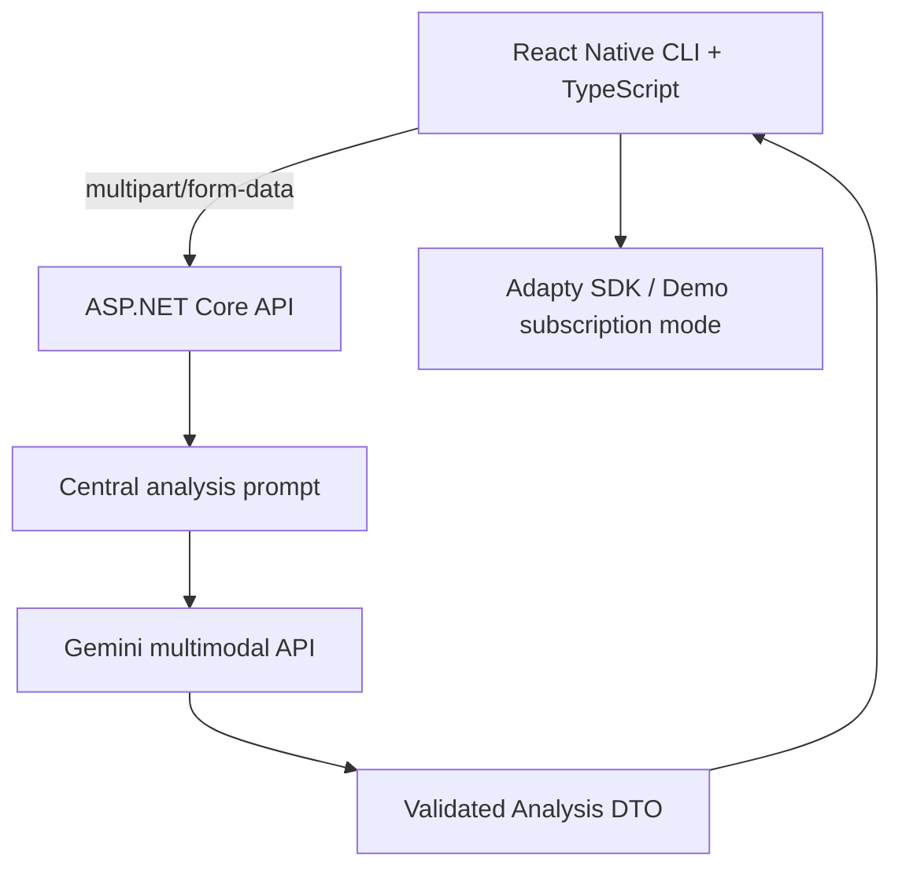
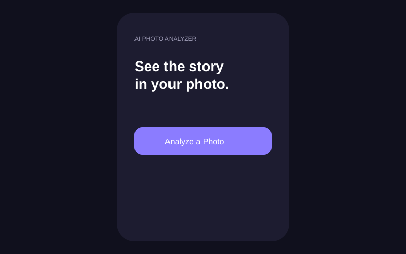
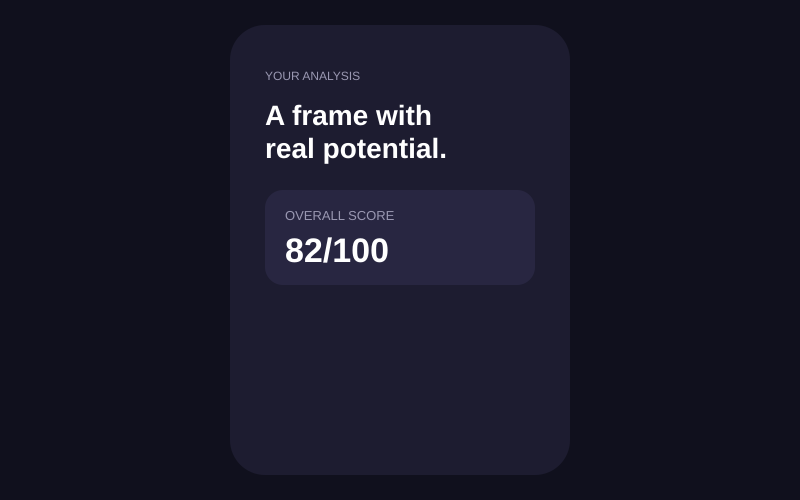

# AI Photo Analyzer Mobile App | React Native + .NET Gemini Multimodal

Production-minded AI photo analysis mobile application built with React Native CLI, TypeScript, ASP.NET Core Web API, C# and Gemini multimodal AI.

Select or capture a photo, upload it securely to the API, and receive structured composition, lighting, quality and subject feedback in a polished mobile experience.

## Highlights

- Gallery and camera photo selection
- Structured AI analysis with resilient JSON parsing
- Real Gemini analysis through a secure backend API (no fake analysis results)
- React Query for server state and Zustand for local UI state
- Adapty-ready subscription boundary with safe demo fallback
- Loading, retry, empty and error states
- Health endpoint, validation, CORS, logging and Swagger

## Architecture



## Tech stack

Mobile: React Native CLI, TypeScript strict, React Navigation, Zustand, TanStack Query, Axios, react-native-image-picker, AsyncStorage, Adapty boundary.

Backend: .NET 8 Minimal API, C#, HttpClient, Gemini REST API, Options pattern, validation, global exception handling, OpenAPI.

## Screenshots

The `docs/screens/` SVG previews document the intended UI when no emulator is available in the build environment.




## Seeded Stitch demo data

The mobile app includes the same local demo photography used by the Stitch UI so the History and Analysis Report screens are immediately reviewable after installation. These assets are bundled into the APK and do not require an external image host.


## Quick start

### Backend

```powershell
cd backend
dotnet restore
dotnet run
```

Swagger: `http://localhost:5080/swagger` and health: `http://localhost:5080/api/health`.

Create `backend/appsettings.Development.json` from the example and put the Gemini key at `Gemini:ApiKey`, or set `GEMINI_API_KEY`. The API intentionally fails clearly when the key is missing; it never returns fake analysis results. Never commit either file or a real key.

### Mobile

```powershell
cd mobile
npm install
npx react-native start
# another terminal
npx react-native run-android
```

Set `API_BASE_URL` in `mobile/src/constants/config.ts`. Android emulator uses `http://10.0.2.2:5080`; a physical device uses your computer LAN IP. iOS uses `http://localhost:5080` on simulator. On iOS run `cd ios; pod install` before `npx react-native run-ios`.

### Adapty

Set `ADAPTY_PUBLIC_SDK_KEY` in `mobile/src/constants/config.ts` and install/configure the Adapty SDK for your store products.

## API

| Method | Route | Purpose |
|---|---|---|
| GET | `/api/health` | API status and demo-mode indicator |
| POST | `/api/analyze/photo` | Multipart upload (`photo`) and analysis |

## Security and performance

The Gemini key exists only on the backend. Uploads are type/size validated, requests are logged without image contents, and AI output is validated before returning to mobile. Production should add authentication, rate limiting, object-storage preprocessing, image resizing/compression, cancellation tokens and persistent history.

## Project structure

```text
backend/                 ASP.NET Core API
  Models/                domain response models
  Services/              Gemini integration and demo result
mobile/src/              screens, components, API, state and navigation
docs/screens/             documentation UI previews
rehber.html               non-technical setup guide
nedir.html                interview learning guide
```

## Interview talking points

React Query owns remote request/cache state; Zustand owns transient UI state. The backend protects the secret and normalizes unreliable model output. Multipart is appropriate for binary upload. Adapty is isolated behind a subscription service so monetization configuration does not block the core product. The project demonstrates RESTful API integration, performance-aware image upload, debugging/error states, reusable components, Git/Git Flow, Android Studio and scalable React Native architecture.
